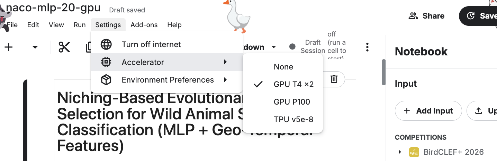

# naco26

## MLP
To run, import the notebook directly into a Kaggle environment, then add the BirdCLEF+ 2026 data. The entire notebook should run in this way. For 19-species MLP, ensure the T4 GPU accelerator is selected.

